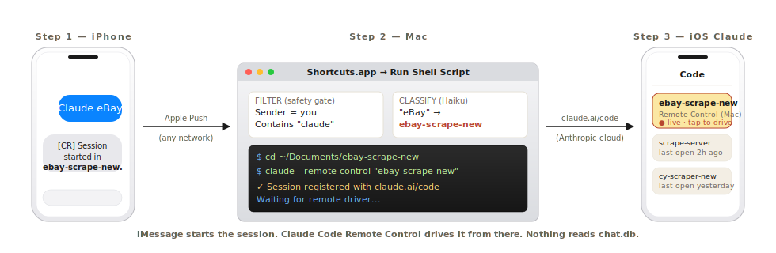
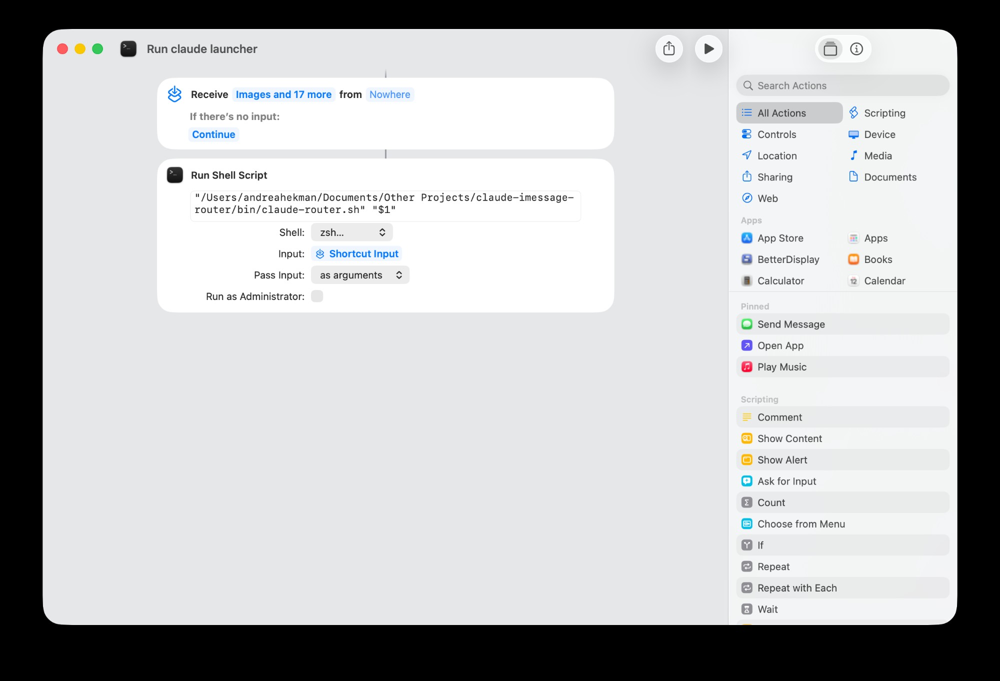
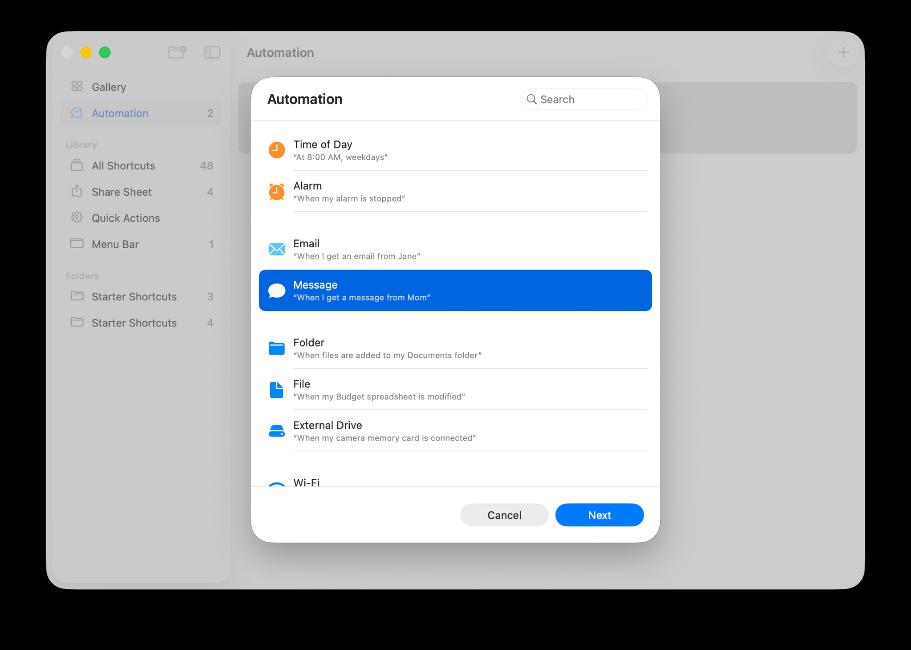
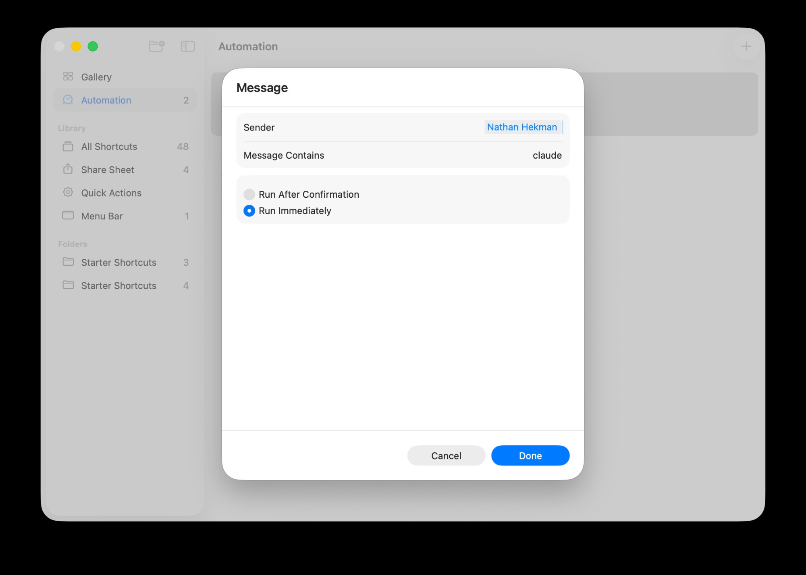

<h1 align="center">cc-imessage-remote-control</h1>

<p align="center">
  <strong>Text yourself <code>Claude eBay</code>. Your Mac opens a Claude Code session in that project.</strong><br>
  iMessage starts it. Claude Code Remote Control drives it from your phone.
</p>

<p align="center">
  <a href="https://nathan-hekman.github.io/cc-imessage-remote-control/"><strong>Landing page →</strong></a> ·
  <a href="#install">Install</a> ·
  <a href="#faq">FAQ</a> ·
  <a href="#how-it-works">How it works</a>
</p>

<p align="center">
  
</p>

---

The Claude iOS app already has Remote Control — drive a Mac session from your phone. But until now you still had to *physically be at the Mac* to start the session. This bridge removes that step.

**You can spin up a Claude Code session from the couch, the airport, or a trail.** One text. One Apple-Push round-trip. Session live in the iOS app a few seconds later.

## What makes this different

> **No iMessage chat history exfiltration. Native macOS Shortcuts only.**

Other "iMessage for Claude" bridges work by reading `~/Library/Messages/chat.db` — your **entire iMessage history**, every conversation, every contact. That's how [BlueBubbles](https://bluebubbles.app/) works, and how Anthropic's own iMessage integration works under the hood. It's powerful, but it's a giant trust ask.

`cc-imessage-remote-control` doesn't read `chat.db`. It doesn't read any message you didn't text yourself. It rides **native macOS Shortcuts** — Apple's first-party "When I get a message" Personal Automation — which gates every trigger by `Sender = you` + `Contains "claude"` *before* the script ever sees a byte. The shell only ever receives **the one matched message body** (which Haiku then classifies into a project slug from a fixed allow-list).

| | cc-imessage-remote-control | BlueBubbles / chat.db readers |
|---|---|---|
| Reads `chat.db` | **No** | Yes — full history |
| Sees other contacts' messages | **No** | Yes |
| Trigger gate | macOS Shortcuts (Apple-native) | Custom listener |
| What the shell sees | One matched message body | Anything Anthropic's MCP server is asked for |
| Failure mode | Trigger silently doesn't fire | History potentially leaks |
| Setup involves | Shortcuts.app + a config file | Granting Full Disk Access to a third-party app |

If you wouldn't grant a third-party app permission to read every iMessage you've ever sent, this is the bridge you want.

## Install

```bash
claude plugin marketplace add nathan-hekman/cc-imessage-remote-control
claude plugin install cc-imessage-remote-control@cc-imessage-remote-control
```

Restart Claude Code. Then:

```
/cc-imessage setup
```

The setup wizard collects your phone number, writes a per-user config file (mode 600, never in the plugin cache), prints the exact line to paste into Shortcuts.app, walks you through the **one shortcut + one automation** flow with inline screenshots, and runs a self-test ping. **About 5 minutes start to finish.**

One-line alternative if you want everything in a single `curl`:

```bash
bash <(curl -fsSL https://raw.githubusercontent.com/nathan-hekman/cc-imessage-remote-control/main/install-claude-code.sh)
```

Full install reference — including local-clone, `--dry-run`, and uninstall — lives in [INSTALL.md](INSTALL.md).

## FAQ

**Do I need Tailscale, a VPN, or to be on the same Wi-Fi as my Mac?**
No. iMessage rides Apple's push network — works from anywhere with cell signal. `claude --remote-control` registers the session with the Anthropic cloud, which your iOS Claude app reaches over its own internet. The only requirement is that your Mac is **powered on, awake, and signed into iMessage**. (Turn on "Wake for network access" in Energy Saver if you want to text-trigger while the Mac is asleep.)

**Does this give Claude access to my entire iMessage history?**
**No.** The router only ever sees one message at a time — the body of the message that matched your Shortcut filter (`Sender = you` + `Message contains "claude"`). Shortcuts passes that body to the shell as `$1`. Haiku is asked to map that one phrase to a project slug. Nothing reads `chat.db` or any other Messages storage. The confirmation reply goes only to the phone number you set in your config.

**How is this different from BlueBubbles or the official Anthropic iMessage integration?**
Both of those work by reading your full chat database (`~/Library/Messages/chat.db`) so a model can see your whole iMessage history. This bridge does **not** do that. It uses Apple's native macOS Personal Automation in Shortcuts.app as the trigger gate — same trust model as any Shortcut you'd build yourself. The bridge can't see any conversation it isn't explicitly triggered on, by you, with the word "claude".

**Can someone else text my Mac "claude" and trigger code execution?**
No. The Shortcuts automation filters on **Sender = your own contact card**. Messages from anyone else are ignored before the shell script ever runs.

**Can the bridge run dangerous shell commands from my texts?**
The message body is **never executed as shell**. It's passed as a *string argument* to Claude Haiku, which is constrained to return one slug from a fixed allow-list of *your own folder names*. Anything else returns `NONE`. Once the Claude Code session is running, normal Claude Code permissions apply — same as if you opened the project yourself.

**Does this cost anything per message?**
A tiny amount. Each trigger fires one call to Claude Haiku 4.5 to classify the project name (few hundred tokens). At current pricing that's well under $0.001 per text. The coding session itself uses your normal Claude Code plan.

**What if I have Pro instead of Max?**
Remote Control is on **Pro and Max** plans. Both work.

**What if my Mac is asleep when I text?**
If "Wake for network access" is on in System Settings → Energy Saver, the Mac wakes for the incoming iMessage push and runs the automation. If it's off, the trigger queues until the Mac is awake again.

## How it works

```
iPhone iMessage              Mac (always-on)                  Anthropic cloud
─────────────────            ────────────────                  ───────────────
"Claude eBay"  ──Apple Push──▶  Shortcuts trigger
                                  matches (sender + "claude")
                                       │
                                       ▼
                                claude-router.sh
                                  │  strip "Claude" off front
                                  │  ask Haiku: "ebay" → which slug?
                                  ├───────────────────────────────────▶  Haiku
                                  ◀── "ebay-scrape-new"  ─────────────
                                  │
                                  ▼
                                Terminal.app opens new window
                                  cd ~/Documents/ebay-scrape-new
                                  claude --remote-control "ebay-scrape-new"
                                                          │
                                                          └─ session registers ─▶ claude.ai
                                                                                       │
                                                                  ◀── iOS Claude app ──┘
                                  ▼
"[CR] Session started in   ◀──────  imessage_send.sh
ebay-scrape-new. Open
the Claude app to continue."
```

The router strips the leading "Claude" off your message body, asks Haiku to map the rest of the phrase to one of your folder names, then `cd`s into that folder and starts `claude --remote-control "<slug>"` in a fresh Terminal window. The `--remote-control` flag auto-registers the session with `claude.ai/code` under the slug, so it appears as a tappable entry in your iOS Claude app's Code tab.

For the full security model — threats, mitigations, what's *not* protected against — see [SECURITY.md](SECURITY.md).

## Setting up the Shortcut

The setup wizard (`/cc-imessage setup`) walks through this interactively. For reference, here's the manual flow:

**Step 1 — One shortcut.** Shortcuts.app → All Shortcuts → **+** → drag in a **Run Shell Script** action.

<p align="center">
  
</p>

- **Shell:** `zsh` (or `/bin/bash`).
- **Pass Input:** `as arguments` (this is the part that lands the message in `$1`).
- **Script:** the path the setup wizard prints. After plugin install it looks like `"$HOME/.claude/plugins/cache/cc-imessage-remote-control/cc-imessage-remote-control/<commit>/bin/claude-router.sh" "$1"`.
- Rename the shortcut to **`Run claude launcher`**.

**Step 2 — One automation.** Shortcuts.app → Automation → **+** → New Automation → pick the **Message** trigger:

<p align="center">
  
</p>

Then configure the filter — your own contact as sender, `claude` as the keyword, **Run Immediately** on:

<p align="center">
  
</p>

On the next screen, delete any default actions, add a single **Run Shortcut** action, point it at `Run claude launcher`, make sure **Pass Input = Shortcut Input**. Done.

## Slash commands

| Command | What |
|---------|------|
| `/cc-imessage setup` | Interactive setup wizard. Writes config, prints the Shortcuts line, opens Shortcuts.app, runs a self-test. |
| `/cc-imessage status` | Shows config (phone masked), project list, last 5 log lines. |
| `/cc-imessage test` | Runs the router locally with a test phrase. No iMessage round-trip required. |
| `/cc-imessage tail` | Last 20 lines of `router.log`. |
| `/cc-imessage help` | Reference card. |

## How to use day-to-day

Anything that starts with the word **"Claude"** triggers the automation. The rest of the message tells Haiku which project to open:

| You text | Router opens |
|----------|--------------|
| `Claude eBay` | `~/Documents/ebay-scrape-new` |
| `Claude scrape server` | `~/Documents/scrape-server` |
| `Claude the courtyard project` | `~/Documents/cy-scraper-new` |
| `Claude ios extension` | `~/Documents/ios-psa-cert-lookup-extension` |
| `Claude` (just the word) | Router texts back a menu of available slugs |

To add a new project, just create the directory under `PROJECTS_ROOT` (or `PROJECTS_ROOT_EXTRA`). No config change — the list is re-scanned every trigger.

## Configuration reference

Config lives at `~/.claude/.cc-imessage-env` (mode 600, written by the setup wizard, never in the plugin cache). See [`.env.example`](.env.example) for the template.

| Variable | Default | Notes |
|----------|---------|-------|
| `IMESSAGE_TARGET` | *(required)* | Your phone number in E.164. Receives the reply iMessage. |
| `IMESSAGE_PREFIX` | `[CR]` | Prepended to every reply. Also the loop-avoidance marker — incoming messages starting with this string are dropped. Don't include the word `claude` lowercase. |
| `ROUTER_MODEL` | `claude-haiku-4-5-20251001` | Model that classifies your phrase. Haiku is plenty. |
| `PROJECTS_ROOT` | `$HOME/Documents` | Primary projects dir, scanned one level deep. |
| `PROJECTS_ROOT_EXTRA` | *(empty)* | Optional, comma-separated extra dirs scanned one level deep. |
| `PROJECTS_EXCLUDE` | *(empty)* | Optional, comma-separated subdir names to skip. Dotfiles are always skipped. |

## Files

```
.claude-plugin/
  plugin.json              — Claude Code plugin manifest (version, hooks)
  marketplace.json         — single-plugin marketplace listing
bin/
  claude-router.sh         — main entry point (Shortcuts → this)
  imessage_send.sh         — Messages.app AppleScript sender
  infer_project.sh         — `claude -p` Haiku wrapper, slug-validated
  build_project_list.sh    — enumerates project candidates
commands/
  cc-imessage.md       — /cc-imessage slash command
skills/
  cc-imessage-setup/   — interactive setup wizard skill
  cc-imessage-help/    — quick-reference card skill
hooks/
  cc-imessage-update-check.js  — daily background ping for new releases
docs/
  index.html               — GitHub Pages landing
  assets/                  — diagram + landing-page assets
  screenshots/             — Shortcuts setup screenshots
.env.example               — config template
INSTALL.md                 — install reference
SECURITY.md                — threat model + mitigations
RELEASING.md               — release process for new versions
```

## Troubleshooting

**Automation never fires.** Open `Shortcuts.app` → Automation → confirm the automation is toggled **on** in the top-right. macOS occasionally disables them after permission prompts.

**Automation fires but Terminal doesn't open.** Check `~/.claude/.cc-imessage-logs/router.log`. Most common cause: `claude: command not found` because Shortcuts runs in a non-interactive shell that doesn't load `.zshrc`. The router adds common install paths to `$PATH`; if your `claude` binary lives somewhere unusual, add it to the `export PATH=...` line in `bin/claude-router.sh`.

**`infer_project.sh` returns NONE every time.** `claude -p` is failing. Run `claude setup-token` to mint a fresh headless OAuth token. The router unsets `ANTHROPIC_API_KEY` and similar before calling `claude -p` so it uses the headless token, not a session-scoped key.

**Reply iMessage never arrives.** Run `bin/imessage_send.sh "test"` manually. macOS will prompt for Messages automation permission the first time. Approve it. If it still fails, check `IMESSAGE_TARGET` is in E.164 format (`+15551234567`, not `(555) 123-4567`).

**Terminal window opens but `claude` exits immediately.** Usually means Remote Control isn't on your Claude Code plan, or your installed `claude` is too old. Confirm with `claude --help | grep remote-control` — if no output, `brew upgrade claude` (or reinstall).

## License

[MIT](LICENSE).
